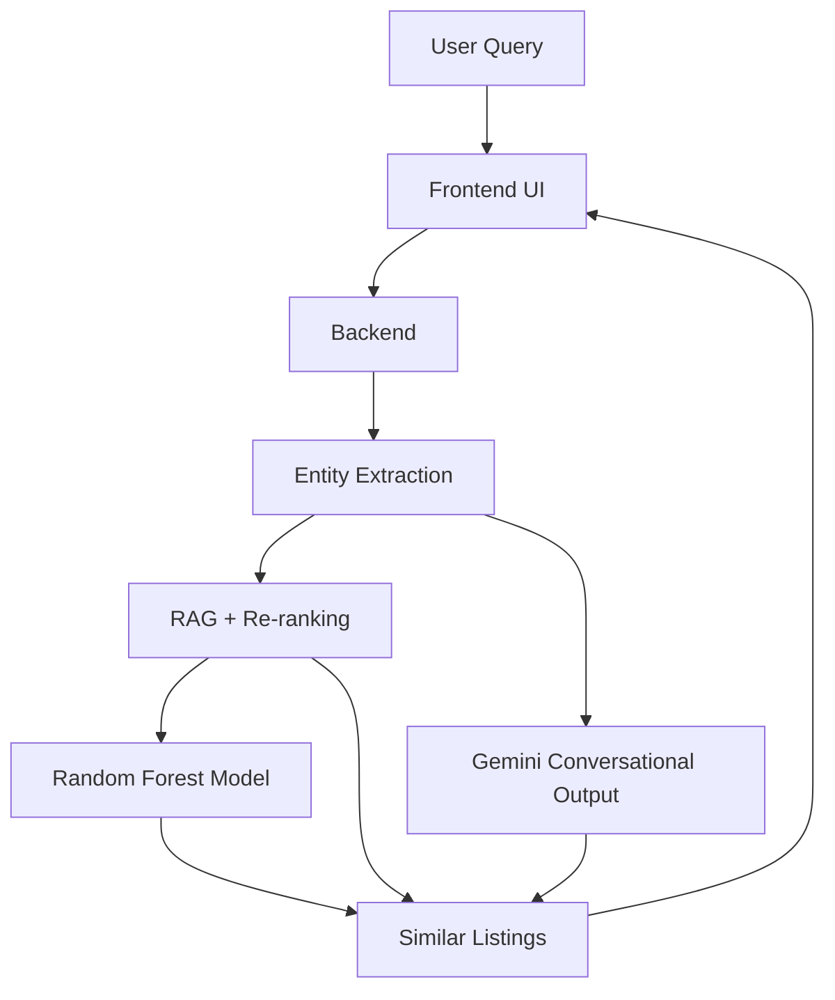

# House Price Prediction System

Welcome to the **House Price Prediction System**, an innovative AI-powered solution that blends cutting-edge **Machine Learning** and **Large Language Models (LLM)** to deliver precise house price predictions and intelligent property search. Powered by **Random Forest**, **RAG (Retrieval-Augmented Generation)**, and **Gemini 2.5 Pro**, this system offers a seamless and conversational experience for home buyers and real estate enthusiasts.

---

## What This System Offers

-  **Accurate Price Predictions**: Leverage a robust Random Forest model to predict house prices based on structured property data.
-  **Smart Property Search**: Use RAG with re-ranking to retrieve and rank similar properties for context-aware recommendations.
-  **Conversational AI**: Engage with a Gemini 2.5 Pro-powered backend for natural language queries, explanations, and suggestions.
-  **User-Friendly Interface**: A clean frontend UI to query properties, view predictions, and explore similar listings.

---

##  Key Features

- **Exploratory Data Analysis (EDA)**: Dive deep into property data with visualizations of distributions, correlations, and feature importance.
- **Preprocessing Pipeline**: Automated data cleaning, encoding, and feature engineering for high-quality predictions.
- **Random Forest Model**: A trained and evaluated model for accurate house price predictions.
- **RAG + Re-ranking**: Retrieve top-k similar properties and re-rank them for optimal relevance using LLM.
- **FastAPI Backend**: Expose powerful API endpoints for seamless frontend-LLM interaction.
- **Conversational AI**: Handle incomplete queries, provide explanations, and support casual conversations with Gemini 2.5 Pro.
- **Simple Frontend**: Query properties and view predictions or similar listings through an intuitive interface.

---

##  System Architecture

The system is designed for modularity and scalability. Below is the corrected flowchart illustrating the architecture:



##  Installation

Get started with the system in just a few steps:

1. **Clone the Repository**:
   ```bash
   git clone https://github.com/8qii/House-Price-Prediction-System.git
   cd house-price-prediction
   ```

2. **Create a Virtual Environment**:
   ```bash
   python -m venv venv
   source venv/bin/activate  # Linux/Mac
   venv\Scripts\activate     # Windows
   ```

3. **Install Dependencies**:
   ```bash
   pip install -r requirements.txt
   ```

---

##  Usage

1. **Start the Backend**:
   Launch the FastAPI server:
   ```bash
   uvicorn backend:app --reload
   ```

2. **Open the Frontend**:
   Open `index.html` in a web browser to interact with the system.

3. **Example Queries**:
   - **Property Search**: "2 BHK flat in Chandkheda with 2 bathrooms and 1200 sqft carpet area"
   - **Similar Listings**: "Show me similar flats near city center"

### Example Interactions:

- **Case 1: Missing Information**  
  **User**: "2 BHK house near city center"  
  **Bot**: Suggests similar properties and prompts for missing details (e.g., Carpet Area, Super Area).

- **Case 2: Complete Information**  
  **User**: "2 BHK flat for sale in Chandkheda, Ahmedabad with 2 bathrooms, 1200 carpet area, 1400 super area"  
  **Bot**: Predicts ₹33.4 Lakh and displays similar listings with few-shot examples.

---

##  Results

- **Random Forest Performance**: Achieves high accuracy on the processed dataset for reliable price predictions.
- **RAG + Re-ranking**: Significantly improves the relevance of retrieved properties.
- **Conversational AI**: Handles diverse queries gracefully, from greetings to missing information, powered by Gemini 2.5 Pro.

---

##  Future Work

We’re excited about the possibilities! Planned enhancements include:
- Integrating **Graph Neural Networks (GNN)** to model spatial relationships between properties.
- Supporting **multi-modal inputs** (e.g., text + house images) for richer queries.
- Deploying a **full-stack web application** with user authentication.

---

##  Authors

- **Hoàng Anh Quân** | Project Owner

---


